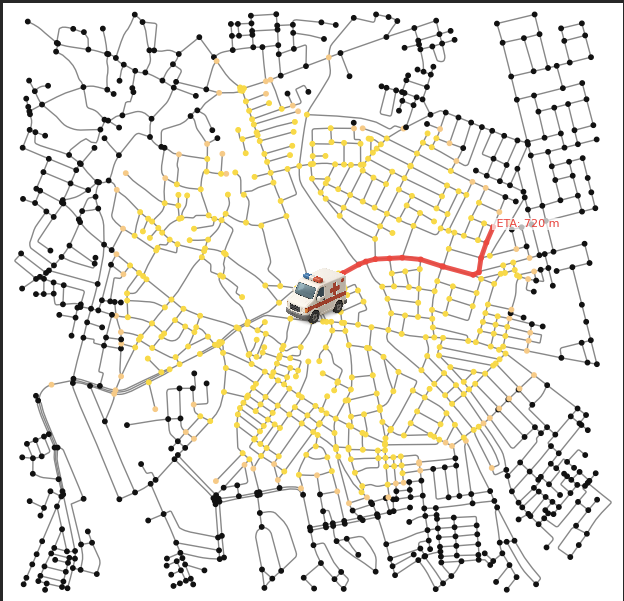
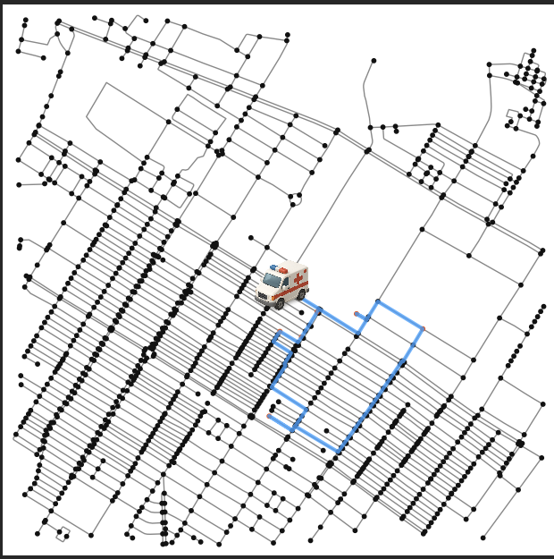
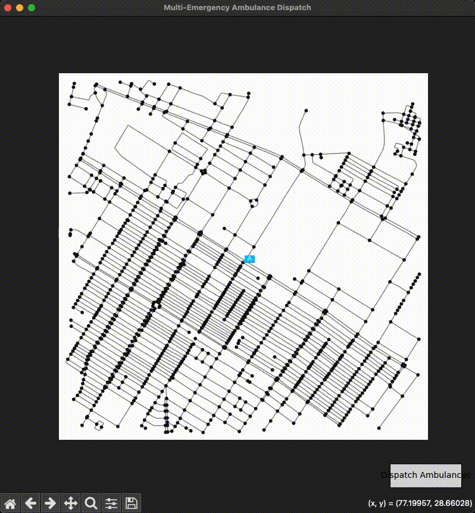

Perfect 👍 Here’s the updated README.md with screenshot/gif placeholders added so you can later replace them with actual files once you capture your runs.

⸻


# 🚑 Emergency Response Simulation with Dijkstra's Algorithm

This project simulates **ambulance dispatch and routing in real-time** using **Dijkstra’s shortest path algorithm** on real-world road networks from **OpenStreetMap**.  
It allows users to interactively select emergency locations on a map, and the program dispatches one or more ambulances with animated visualization of their routes.

---

## ✨ Features

### ✅ Single Emergency Simulation
- User selects **1 emergency location** on the map.
- The program computes the **shortest path** from the base station to the emergency using **Dijkstra’s algorithm**.
- The ambulance icon is animated along the computed path.
- Nodes and routes are highlighted dynamically.

🖼️ Example:  


---

### ✅ Multi-Emergency Simulation
- User can select **up to 6 emergencies**.
- Only **2 ambulances** are available.
- The system automatically:
  - Computes all-pairs shortest paths between base and emergencies.
  - Finds the **optimal partition of emergencies** between the 2 ambulances.
  - Chooses the order of visits for each ambulance using brute-force permutation (feasible since max emergencies = 6).
  - Minimizes **total travel distance** across both ambulances.
- Both ambulance routes are displayed with distinct colors and animated movement.

🖼️ Example:  


🎥 Animation Demo (placeholder GIF):  


---

## ✅ Visualization
- Interactive **Matplotlib map** with OpenStreetMap data.
- Base station marked in **blue**, emergencies in **orange-red**.
- Ambulance routes drawn in **red (Ambulance 1)** and **blue (Ambulance 2)**.
- Ambulance icons move node by node, simulating real dispatch.

---

## 🛠️ Technologies Used
- **[OSMnx](https://osmnx.readthedocs.io/)** → Fetch real-world road networks from OpenStreetMap.  
- **[NetworkX](https://networkx.org/)** → Graph algorithms (Dijkstra, shortest paths).  
- **[Matplotlib](https://matplotlib.org/)** → Interactive visualization & animations.  
- **Python (3.9+)**

---

## 📂 Project Structure

emergency_djakstra/
│
├── visual.py          # Single-emergency Dijkstra simulation
├── animation.py       # Ambulance animation logic (single emergency)
├── multiemergency.py  # Multi-emergency simulation with 2 ambulances
├── ambulance.png      # Ambulance icon used in the animations
└── README.md          # Documentation (this file)

---

## 🚀 How to Run

### 1️⃣ Install dependencies
```bash
pip install osmnx networkx matplotlib

2️⃣ Run single emergency simulation

python visual.py

	•	A map window will open.
	•	Click anywhere on the map to set an emergency location.
	•	The ambulance will find the shortest path and animate to that location.

3️⃣ Run multi-emergency simulation

python multiemergency.py

	•	A map window will open.
	•	Click up to 6 emergency locations on the map.
	•	Press “Dispatch Ambulances” (button in the bottom right).
	•	The program will compute the optimal assignment of emergencies between the two ambulances and animate both routes.

⸻

📊 Example Workflow
	1.	Start multiemergency.py.
	2.	Select 4 emergencies on the map.
	3.	Click Dispatch Ambulances.
	4.	Console output:

Best total route cost: 1527.4
Best partition: ([1, 3], [2, 4])
Best routes: ((1, 3), (2, 4))
Ambulance 1 full path nodes: [...]
Ambulance 2 full path nodes: [...]


	5.	The map shows:
	•	Red route = Ambulance 1
	•	Blue route = Ambulance 2
	•	Ambulance icons moving along their assigned paths

⸻

🔮 Future Improvements

Here are possible next-level upgrades:
	•	⏱️ Real-time traffic data integration (weight edges by live speed/traffic).
	•	🛰️ GPS tracking simulation with dynamic rerouting.
	•	🏥 Hospital selection logic (ambulance delivers to nearest available hospital).
	•	🤖 AI-based assignment for scalable dispatch with more emergencies & ambulances.
	•	📱 Web or mobile interface using Flask/Django + Leaflet/Mapbox.

⸻

🙌 Acknowledgments
	•	OpenStreetMap contributors for map data.
	•	OSMnx & NetworkX developers for excellent open-source libraries.
	•	This project was built step by step to explore graph algorithms, optimization, and interactive visualization.

⸻

📌 Summary

This project demonstrates how graph theory (Dijkstra) can be applied to real-world emergency response systems:
	•	From basic shortest-path simulation (one ambulance, one emergency).
	•	To multi-agent, multi-task optimization (two ambulances, multiple emergencies).
	•	With clear visualizations and animations to make the algorithm’s decisions transparent.

🚑 Optimizing emergency response, one path at a time!
